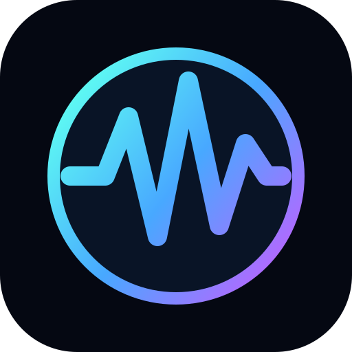

# TheVisualizer

<p align="center"></p>

TheVisualizer is a standalone, modern-retro visualization player inspired by Winamp-era music visualizers. Its primary goal is to react to audio already playing on the computer—from music players, browsers, games, and videos—as well as microphone input.

The first release target is Windows desktop. The intended experience is simple: choose an audio source and visual, then run it in a window, borderless, or fullscreen. The application will not be a media player.

## Project status

TheVisualizer now has a Windows desktop prototype with live system-audio loopback, microphone capture, FFT analysis, ten audio-reactive modes, draggable sound zones, routed colors/materials, named saved scenes, a compact overlay, and windowed, borderless, and fullscreen presentation. Eight modes are declarative WGSL presets with grouped sliders; the two host-rendered modes provide waveform trails and frequency-ordered particles. An experimental Studio can layer those visual families with local images. A portable local-test Windows package containing Studio has passed a same-host fresh-extraction smoke, while clean-machine validation remains open. Public releases, additional platforms, and embedded support remain unimplemented. See [Project Truth](PROJECT_TRUTH.md) for exact runtime evidence and the [Roadmap](ROADMAP.md) for planned work.

## Current prototype

- Windows system-audio loopback and microphone input
- Explicit output and microphone device selection with refresh
- Automatic Windows default-device following with visible AUTO and PINNED modes
- Waveform, spectrum, energy, and frequency-band analysis
- Live newest-sample-to-feature age telemetry with current, average, peak, and separate FFT-window timing
- Automatic default-output recovery timing from detection through stream open and first capture packet
- Ten bundled modes: Neon Scope, Particle Forge, Feedback Tunnel, Solar Bloom, Neon Horizon, Gravity Wells, Ripple Garden, Kaleido Reactor, Aurora Flow, and TheVisualCityScape
- Up to eight draggable sound zones with independent Full, Bass, Mid, or Treble routing, radius, strength, and pin state
- A visible `Instrument [I]` panel and matching right-click menu for mode selection, live band meters, grouped per-mode sliders, sound zones, seven palettes, five material finishes, per-band colors, and gradient controls for glow, gloss, and saturation
- Named `.tvscene` snapshots that restore the exact mode, relevant sliders, routed colors, material treatment, camera, and sound zones across application restarts
- A local Visual Director with rolling Visual DNA, structured novelty-scored scene invention, 17 capture choices, controlled photographic imperfections, preflight critique, generation-ready prompts, durable local brief history, and Markdown brief export without making an API request
- An experimental Studio layer stack for local images, GPU presets, waveform, and particles, with one original photorealistic `Living Photograph` composition and bounded real foliage motion
- Local `.tvpreset` discovery, format-2 grouped parameters, refresh, bounded fixed-size waveform/spectrum/scene/control GPU inputs, and safe shader rejection
- A size-tagged C ABI, strict `.tvplugin` discovery, SHA-256 session approval, and repository-owned example plugin
- Named Scope, Particles, and Preset controls plus keyboard navigation in a compact overlay, with source-aware quiet-state guidance and technical diagnostics/native extensions behind a discoverable details disclosure
- A repository-owned waveform mark embedded as the native application/window icon
- Display-synchronized, 60 FPS, and 30 FPS pacing choices with measured application cadence
- Windowed, borderless, and fullscreen presentation

## Run locally

Install a current Rust toolchain, then run:

```powershell
cargo build --workspace
cargo run -p thevisualizer
```

The workspace build also produces the example native-plugin DLL. The prototype starts in automatic mode on the default Windows output device and follows later default changes. Choosing a specific endpoint from the device menu pins it until `S` returns to automatic system output or `M` returns to automatic microphone input. Refresh rescans devices, Left/Right cycles visual directions, `1`/`2`/`3` selects one directly, Up/Down switches GPU presets, `I` toggles the visible Instrument panel, `B` toggles borderless presentation, `F11` toggles fullscreen, and `Tab` hides the overlay. The Instrument panel and right-click menu expose controls relevant to the active mode rather than one generic control list. Its Saved Scenes section captures and restores named views. Drag a zone to reposition it, drag empty space to rotate supported scenes, use the wheel to zoom, double-click empty space to add a zone, and press `R` to reset interaction. `Escape` closes the Instrument panel first, then returns to windowed mode before closing the app.

To create the portable local-test Windows archive:

```powershell
.\scripts\package-windows.ps1
```

This is not a signed public release. See [Windows Packaging](docs/PACKAGING.md).

## Remaining v0.1 work

- Clean-machine, device-loss, mixed-DPI, multi-monitor, and broader GPU validation
- Externally measured playback-to-display latency
- Public-release validation

The detailed boundary is defined in [v0.1 Scope](docs/V0.1_SCOPE.md).

## Extensions

The implemented extension model has two tiers:

1. Declarative shader presets for portable visuals and adjustable parameters.
2. Versioned native plugins for trusted code that needs CPU-side behavior.

Discovered native plugins remain disabled until the user reviews the exact artifact and selects `Approve & Load`. Approval lasts only for that run, is tied to the DLL's SHA-256 digest, and is not sandboxing or signing. See [Presets and Plugins](docs/PRESETS_AND_PLUGINS.md) and the [Plugin SDK](plugin-sdk/README.md).

Future work may add MIDI, OSC, sensors, telemetry, and network inputs. Separate post-v0.1 research will explore standalone visualizers for ESP32-class displays, M5Tab5, and LED controllers. Desktop plugins and shaders are not assumed to run unchanged on embedded hardware.

## Documentation

- [Project Truth](PROJECT_TRUTH.md)
- [Roadmap](ROADMAP.md)
- [v0.1 Scope](docs/V0.1_SCOPE.md)
- [Architecture](docs/ARCHITECTURE.md)
- [Presets and Plugins](docs/PRESETS_AND_PLUGINS.md)
- [Interactive Modes](docs/INTERACTIVE_MODES.md)
- [Visual Director](docs/VISUAL_DIRECTOR.md)
- [Architecture Decisions](docs/DECISIONS.md)
- [Windows Packaging](docs/PACKAGING.md)
- [Licensing](docs/LICENSING.md)
- [Embedded Vision](docs/EMBEDDED_VISION.md)
- [Open Questions](docs/OPEN_QUESTIONS.md)

## License

TheVisualizer's original code, documentation, bundled WGSL presets, plugin SDK, and example plugin are licensed under the [Apache License 2.0](LICENSE). No MilkDrop/projectM code or community presets are included. Future compatibility assets require explicit, artifact-level provenance; see [Licensing](docs/LICENSING.md).
